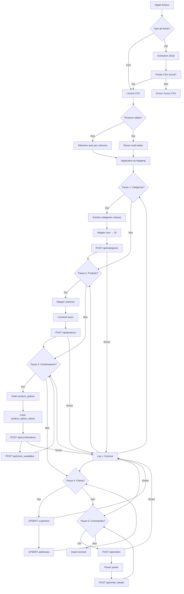

# Import PrestaShop - Schéma et Workflow

**Date**: 13 Mai 2026  
**Version**: 1.0

---

## 1. Architecture Globale

```
┌─────────────────────────────────────────────────────────────────┐
│                     INTERFACE UTILISATEUR                        │
│                   ImportWizard.vue                                │
└─────────────────────────────┬───────────────────────────────────┘
                              │
                              ▼
┌─────────────────────────────────────────────────────────────────┐
│                    IMPORT ORCHESTRESTRATOR                        │
│                  import-orchestrator.ts                           │
│  ┌─────────────┐  ┌─────────────┐  ┌─────────────────────┐   │
│  │ File Loader │  │ CSV Parser  │  │   ZIP Extractor     │   │
│  └─────────────┘  └─────────────┘  └─────────────────────┘   │
│                                                                  │
│  ┌──────────────────────────────────────────────────────────┐   │
│  │                 DEPENDENCY RESOLVER                       │   │
│  │  Categories → Products → Combinations → Customers →     │   │
│  │  Addresses → Orders → OrderDetails                       │   │
│  └──────────────────────────────────────────────────────────┘   │
└─────────────────────────────┬───────────────────────────────────┘
                              │
                              ▼
┌─────────────────────────────────────────────────────────────────┐
│                      PRESTASHOP API                               │
│              POST /api/products, /api/categories, etc.           │
└─────────────────────────────────────────────────────────────────┘
```

---

## 2. Structure des Fichiers

```
src/features/import/
│
├── components/
│   ├── ImportWizard.vue           # Interface principale
│   ├── FileDropZone.vue          # Zone de drop CSV/ZIP
│   ├── FileListItem.vue          # Liste des fichiers sélectionnés
│   ├── MappingPreview.vue        # Aperçu du mapping
│   └── ImportProgress.vue        # Barre de progression
│
├── services/
│   ├── import-orchestrator.ts     # Coordination globale
│   ├── csv-parser.service.ts      # Parsing CSV
│   ├── zip-extractor.service.ts   # Extraction ZIP
│   ├── column-mapper.service.ts  # Application mapping
│   ├── category-extractor.ts      # Extraire catégories
│   ├── dependency-resolver.ts     # Ordre d'import
│   ├── prestashop-adapter.ts     # Conversion XML
│   ├── cart-parser.ts            # Parser "[("ref";qty)]"
│   └── tax-lookup.ts             # Conversion taxe % → ID
│
├── types/
│   └── import.types.ts           # Types TypeScript
│
└── mapping/
    └── default-mapping.json      # Mapping par défaut
```

---

## 3. Types TypeScript

```typescript
// src/features/import/types/import.types.ts

export interface ImportFile {
  id: string;
  file: File;
  name: string;
  type: 'csv' | 'zip';
  detectedEntity?: 'product' | 'combination' | 'customer' | 'order' | 'unknown';
  rows: number;
  preview: Record<string, string>[];
}

export interface ColumnMapping {
  sourceColumn: string;
  targetColumn: string;
  transform?: 'taxe_to_id' | 'categorie_to_id' | 'none';
}

export interface EntityMapping {
  entity: 'product' | 'combination' | 'customer' | 'order' | 'category';
  columns: ColumnMapping[];
  fixedValues?: Record<string, string>;
}

export interface ImportConfig {
  files: ImportFile[];
  mappings: EntityMapping[];
  options: ImportOptions;
}

export interface ImportOptions {
  skipDuplicates: boolean;
  continueOnError: boolean;
  createCategories: boolean;
}

export interface ImportProgress {
  phase: 'parsing' | 'mapping' | 'importing' | 'complete' | 'error';
  currentStep: string;
  totalSteps: number;
  currentStepIndex: number;
  percentage: number;
  details: ImportDetail[];
}

export interface ImportDetail {
  entity: string;
  status: 'pending' | 'in_progress' | 'success' | 'error' | 'skipped';
  imported: number;
  failed: number;
  errors: ImportError[];
}

export interface ImportError {
  row: number;
  field: string;
  value: string;
  message: string;
  code: 'MISSING_DEPENDENCY' | 'INVALID_VALUE' | 'API_ERROR' | 'PARSE_ERROR';
}

export interface ParsedRow {
  source: Record<string, string>;
  mapped: Record<string, string>;
  xml: string;
  entity: string;
  rowIndex: number;
}

export interface CategoryMapping {
  name: string;
  id?: number;
  parentId: number;
}
```

---

## 4. Workflow d'Import (Flowchart)



---

## 5. Ordre d'Import (Dépendances)

```
┌─────────────────────────────────────────────────────────────────┐
│                     ORDRE D'IMPORT                               │
│                                                                 │
│  1. CATEGORIES                                                  │
│     └─ Extraire de Fichier 1 (colonne "categorie")             │
│     └─ Créer dans PS (id_parent = 2 = Home)                    │
│     └─ Mapper: { "Akanjo": 5, "Accessoire": 6 }               │
│                                                                 │
│  2. PRODUCTS                                                    │
│     └─ Utiliser mapping category_id → ID                       │
│     └─ Convertir taxe % → tax_rule_id                          │
│     └─ POST /api/products                                      │
│                                                                 │
│  3. PRODUCT_OPTIONS (Taille, Couleur)                          │
│     └─ Extraire "spécificité" uniques de F2                    │
│     └─ POST /api/product_options                               │
│                                                                 │
│  4. PRODUCT_OPTION_VALUES (ngoza, kely, mainty, fotsy)        │
│     └─ POST /api/product_option_values                         │
│                                                                 │
│  5. COMBINATIONS                                               │
│     └─ Référence produit DOIT exister                          │
│     └─ POST /api/combinations                                  │
│                                                                 │
│  6. STOCK_AVAILABLES                                           │
│     └─ POST /api/stock_availables (quantity)                   │
│                                                                 │
│  7. CUSTOMERS                                                  │
│     └─ UPSERT par email (update si existe)                      │
│     └─ POST /api/customers                                     │
│                                                                 │
│  8. ADDRESSES                                                  │
│     └─ POST /api/addresses                                     │
│                                                                 │
│  9. ORDERS                                                     │
│     └─ Parser champ "achat"                                     │
│     └─ POST /api/orders                                        │
│                                                                 │
│  10. ORDER_DETAILS                                             │
│     └─ Pour chaque "[("T_01";3;"ngoza")]"                     │
│     └─ POST /api/order_details                                 │
│                                                                 │
└─────────────────────────────────────────────────────────────────┘
```

---

## 6. Parsing du Panier

```typescript
// Format: [("reference";quantité;spécificité)]
// Exemple: [("T_01";3;"ngoza"),("P_01";2;"mainty")]

interface CartItem {
  reference: string;
  quantity: number;
  specificity: string;
}

function parseCart(cartString: string): CartItem[] {
  // Supprimer crochets
  const content = cartString.replace(/^\[|\]$/g, '');
  
  // Split par ),(
  const items = content.split('),(').map(s => s.replace(/[()"]/g, ''));
  
  return items.map(item => {
    const [ref, qty, spec] = item.split(';');
    return {
      reference: ref.trim(),
      quantity: parseInt(qty.trim(), 10),
      specificity: spec?.trim() || ''
    };
  });
}

// Résultat:
// [{ reference: "T_01", quantity: 3, specificity: "ngoza" }]
```

---

## 7. Conversion Taxe

```typescript
// 11,65% → tax_rule_id (via lookup BDD ou config)

const TAX_MAPPING: Record<string, number> = {
  '0%': 1,           // Pas de taxe
  '5.5%': 2,         // TVA réduite
  '10%': 3,          // TVA intermédiaire
  '11.65%': 4,       // Votre taxe
  '20%': 5,          // TVA standard
};

function convertTaxeToId(taxeString: string): number {
  // Nettoyer: "11,65%" → "11.65%"
  const normalized = taxeString.replace(',', '.').replace('%', '').trim();
  const key = normalized + '%';
  
  return TAX_MAPPING[key] || 0; // 0 = Pas de taxe si non trouvé
}
```

---

## 8. Format XML PrestaShop

```xml
<!-- Product XML -->
<?xml version="1.0" encoding="UTF-8"?>
<prestashop xmlns:xlink="http://www.w3.org/1999/xlink">
  <product>
    <name><language id="1"><![CDATA[Tshirt]]></language></name>
    <reference><![CDATA[T_01]]></reference>
    <price><![CDATA[12.5]]></price>
    <tax_rate><![CDATA[11.65]]></tax_rate>
    <id_category_default><![CDATA[5]]></id_category_default>
    <wholesale_price><![CDATA[8.5]]></wholesale_price>
    <active><![CDATA[1]]></active>
  </product>
</prestashop>

<!-- Combination XML -->
<?xml version="1.0" encoding="UTF-8"?>
<prestashop xmlns:xlink="http://www.w3.org/1999/xlink">
  <combination>
    <id_product><![CDATA[1]]></id_product>
    <reference><![CDATA[T_01]]></reference>
    <associations>
      <product_option_values>
        <product_option_value>
          <id><![CDATA[3]]></id>
        </product_option_value>
      </product_option_values>
    </associations>
  </combination>
</prestashop>
```

---

## 9. Interface - États

```
┌─────────────────────────────────────────────────────────────────┐
│                         ETAT: INITIAL                            │
│  ┌───────────────────────────────────────────────────────────┐  │
│  │                                                           │  │
│  │      📁                                                   │  │
│  │      Déposez vos fichiers CSV ou ZIP ici                   │  │
│  │      [Cliquer pour sélectionner]                          │  │
│  │                                                           │  │
│  └───────────────────────────────────────────────────────────┘  │
└─────────────────────────────────────────────────────────────────┘

                            │
                            ▼ (Fichiers déposés)

┌─────────────────────────────────────────────────────────────────┐
│                       ETAT: FICHIERS PRÊTS                       │
│  ┌───────────────────────────────────────────────────────────┐  │
│  │  📄 fichier1.csv  (48 lignes)  [Détecté: Products]  [✓] │  │
│  │  📄 fichier2.csv  (15 lignes)  [Détecté: Combinations][✓] │  │
│  │  📄 fichier3.csv  (12 lignes)  [Détecté: Orders]    [✓]  │  │
│  └───────────────────────────────────────────────────────────┘  │
│                                                                  │
│  Mapping detected: [Voir] [Modifier]                            │
│                                                                  │
│                          [Lancer l'import]                      │
└─────────────────────────────────────────────────────────────────┘

                            │
                            ▼ (Import en cours)

┌─────────────────────────────────────────────────────────────────┐
│                      ETAT: IMPORT EN COURS                       │
│  ┌───────────────────────────────────────────────────────────┐  │
│  │  Progression: ████████████░░░░░░░░░░ 65%                 │  │
│  └───────────────────────────────────────────────────────────┘  │
│                                                                  │
│  ✓ Catégories .............. 2/2     100%                      │
│  ✓ Products ............... 15/15    100%                      │
│  ◔ Combinations ........... 12/18     67%  ← En cours         │
│  ○ Customers .............. 0/8        0%                      │
│  ○ Orders ................ 0/8        0%                      │
│                                                                  │
│  [Annuler]                                                   │
└─────────────────────────────────────────────────────────────────┘

                            │
                            ▼ (Terminé)

┌─────────────────────────────────────────────────────────────────┐
│                      ETAT: IMPORT TERMINÉ                        │
│  ┌───────────────────────────────────────────────────────────┐  │
│  │                    ✅ IMPORT RÉUSSI                        │  │
│  │                                                           │  │
│  │  15 produits importés                                    │  │
│  │  18 combinaisons créées                                  │  │
│  │  3 clients créés                                         │  │
│  │  3 commandes enregistrées                                │  │
│  │                                                           │  │
│  │  [Voir rapport détaillé]  [Fermer]                       │  │
│  └───────────────────────────────────────────────────────────┘  │
└─────────────────────────────────────────────────────────────────┘
```

---

## 10. Gestion des Erreurs

| Code Erreur | Description | Action |
|-------------|-------------|--------|
| `MISSING_DEPENDENCY` | Référence produit inexistante | Skip, logger |
| `INVALID_TAXE` | Taxe non reconnue | Utiliser 0, logger warning |
| `INVALID_CATEGORY` | Catégorie non trouvée | Créer avec id_parent=2 |
| `API_ERROR` | Erreur POST PrestaShop | Retry x3, puis skip |
| `PARSE_ERROR` | Format CSV invalide | Skip ligne |
| `DUPLICATE_EMAIL` | Client existe déjà | Update au lieu de create |
| `INVALID_CART` | Format panier invalide | Skip commande |

---

## 11. API Endpoints PrestaShop Utilisés

| Méthode | Endpoint | Usage |
|---------|----------|-------|
| GET | `/api/categories` | Lister catégories existantes |
| POST | `/api/categories` | Créer catégorie |
| GET | `/api/products` | Vérifier existence |
| POST | `/api/products` | Créer produit |
| GET | `/api/product_options` | Lister options |
| POST | `/api/product_options` | Créer option (taille, couleur) |
| POST | `/api/product_option_values` | Créer valeur (ngoza, kely) |
| POST | `/api/combinations` | Créer combinaison |
| POST | `/api/stock_availables` | Définir stock |
| GET | `/api/customers` | Vérifier existence par email |
| POST | `/api/customers` | Créer client |
| POST | `/api/addresses` | Créer adresse |
| POST | `/api/orders` | Créer commande |
| POST | `/api/order_details` | Créer détail commande |

---

## 12. Mapping JSON par Défaut

```json
{
  "version": "1.0",
  "entities": {
    "category": {
      "sourceColumn": "categorie",
      "targetColumn": "name",
      "fixedValues": {
        "id_parent": "2",
        "active": "1"
      }
    },
    "product": {
      "columns": {
        "produit": "name",
        "reference": "reference",
        "prix_ttc": "price",
        "Taxe": "tax_rate",
        "categorie": "id_category_default",
        "prix_achat": "wholesale_price",
        "date_availability": "available_now"
      },
      "fixedValues": {
        "active": "1"
      },
      "transforms": {
        "categorie": "categorie_to_id",
        "Taxe": "taxe_to_id"
      }
    },
    "combination": {
      "columns": {
        "reference": "reference",
        "spécificité": "attribute_name",
        "karazany": "attribute_value",
        "stock_initial": "quantity",
        "prix_vente_ttc": "price"
      },
      "transforms": {
        "reference": "product_reference_to_id"
      }
    },
    "customer": {
      "columns": {
        "nom": "firstname",
        "email": "email",
        "pwd": "passwd"
      },
      "fixedValues": {
        "active": "1"
      }
    },
    "address": {
      "columns": {
        "nom": "firstname",
        "adresse": "address1"
      },
      "requiredDeps": ["customer"]
    },
    "order": {
      "columns": {
        "date": "date_add",
        "email": "customer_email",
        "etat": "current_state"
      },
      "transforms": {
        "etat": "order_state_to_id"
      }
    }
  },
  "taxMappings": {
    "0%": 1,
    "5.5%": 2,
    "10%": 3,
    "11.65%": 4,
    "20%": 5
  },
  "orderStateMappings": {
    "paiement accepté": 2,
    "en cours": 3,
    "livré": 5
  }
}
```

---

*Document généré le 13 Mai 2026*
